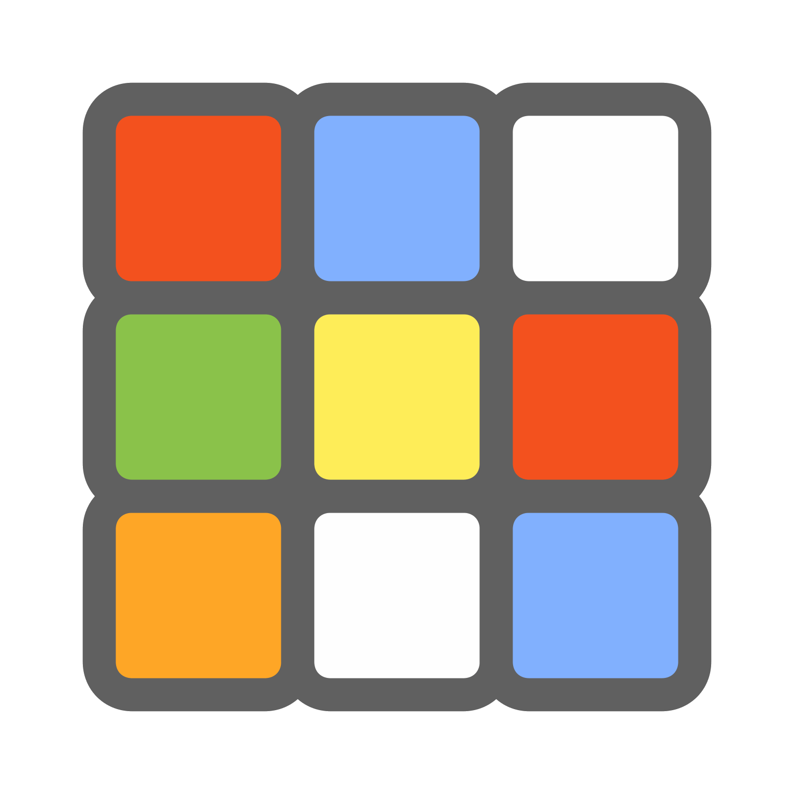

<!-- PROJECT LOGO -->

 

<h1 align=\"center\">cubeSolver</h1>

a python app wich recognize the scramble of a rubiks cube using opencv, then it finds the solution using kociemba algorithm.
  
 
  
<a href="https://github.com/quentinformatique/cubeSolver/releases/latest">Download</a>
·
<a href="https://github.com/quentinformatique/cubeSolver/blob/master/CHANGELOG.md">Changelog</a>
·
<a href="https://github.com/quentinformatique/cubeSolver/issues/new/choose">Report Bug</a>
·
<a href="https://github.com/quentinformatique/cubeSolver/issues/new/choose">Request Feature</a>

 

## Sources

<a href="https://pypi.org/project/kociemba/">Kociemba algorithm</a> 
<a href="https://pypi.org/project/opencv-python/">openCV</a> 

## About The Project  

The project is using the kociemba algorithm to solve the cube, it is a two-phase algorithm. In the first phase, a table of all possible positions of the corners is created. In the second phase, the positions of the edges are solved using the table of the corners.

In order to use the kociemba algorithm, the cube must be in a specific format. The cube is represented by a string of 54 characters, each character representing the color of a sticker. The order of the characters is defined as follows: first the U face, then the R face, then the F face, then the D face, then the L face and finally the B face. The order of the stickers on each face is from left to right and from top to bottom. The colors are represented by the following characters: U (up, white), R (right, red), F (front, green), D (down, yellow), L (left, orange) and B (back, blue). The following figure shows the order of the faces and the stickers on each face.

To recognize the cube, the program uses opencv to detect the colors of the stickers. The program uses the webcam of the computer to take a picture of the cube. Then, the program detects the colors of the stickers and creates a string of 54 characters representing the cube. The program then uses the kociemba algorithm to find the solution to the cube. Finally, the program displays the solution on the screen.
